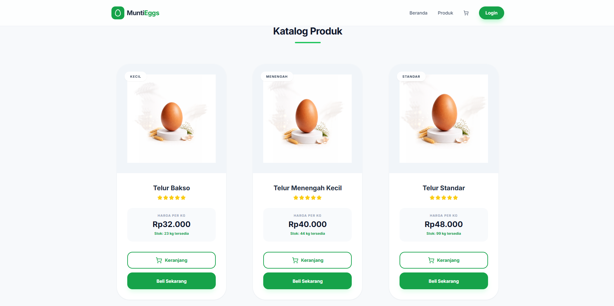
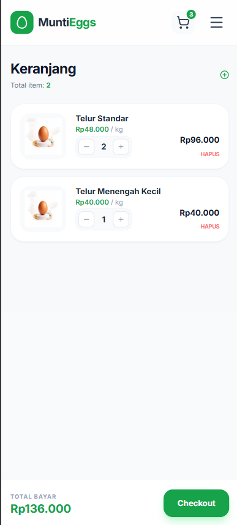
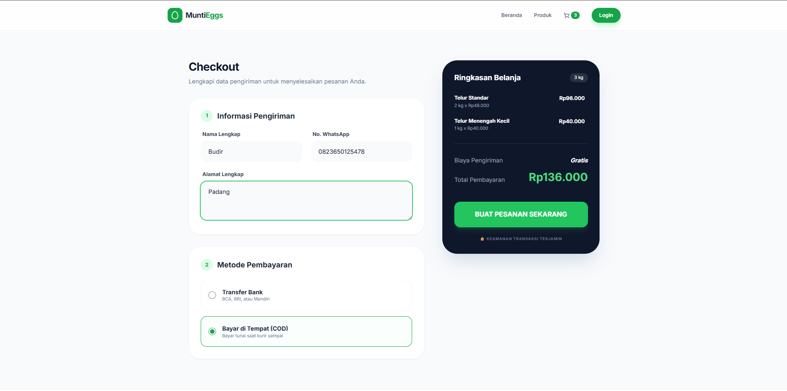

# MuntiEggs - E-Commerce Management System 🥚🚀

MuntiEggs adalah platform e-commerce khusus penjualan hasil ternak (telur) yang mengintegrasikan pengalaman belanja pelanggan dengan sistem manajemen admin yang komprehensif. Aplikasi ini dirancang untuk mempermudah transaksi antara peternak dan konsumen secara real-time.

## ✨ Fitur Unggulan

* **Katalog Produk Responsif**: Tampilan produk yang bersih dengan informasi stok, harga per kg, dan kategori ukuran (Kecil, Menengah, Standar).
* **Sistem Keranjang & Checkout**: Proses belanja yang intuitif mulai dari pemilihan jumlah item hingga ringkasan belanja otomatis.
* **Manajemen Order**: Alur pesanan yang jelas dengan status pembayaran (Bayar di Tempat/Transfer) dan kode transaksi unik.
* **Dashboard Ringkasan Bisnis**: Panel admin untuk memantau performa penjualan, total omzet, jumlah order, dan log transaksi terbaru secara real-time.
* **Mobile Friendly**: Antarmuka yang dioptimalkan untuk perangkat mobile guna memudahkan pelanggan berbelanja dari mana saja.

## 📸 Dokumentasi Antarmuka

### 1. Katalog Produk & Keranjang

*Antarmuka belanja utama dengan grid produk yang modern dan fitur keranjang belanja.*

### 2. Keranjang Pemesanan ( Mobile )

*Antarmuka Keranjang Pemesanan Untuk Tampilan Mobile.*

### 3. Proses Checkout & Pembayaran

*Halaman pengisian data pengiriman dan pemilihan metode pembayaran (COD/Transfer).*

### 4. Konfirmasi Pesanan Berhasil

*Halaman sukses setelah pesanan dibuat, lengkap dengan instruksi langkah selanjutnya.*

### 5. Admin Business Dashboard

*Panel kontrol admin untuk memantau ringkasan bisnis dan performa harian.*

## 🛠️ Teknologi

* **Frontend**: Tailwind CSS (UI Design)
* **Backend**: PHP (Logic & Transaction Process)
* **Database**: MySQL (Storage Data)
* **Icons**: Font Awesome / Heroicons

## ⚙️ Instalasi

1. Clone repository:
   ```bash
   git clone [https://github.com/Ceplin03/E-Commerce-Peternakan.git](https://github.com/Ceplin03/E-Commerce-Peternakan.git)
